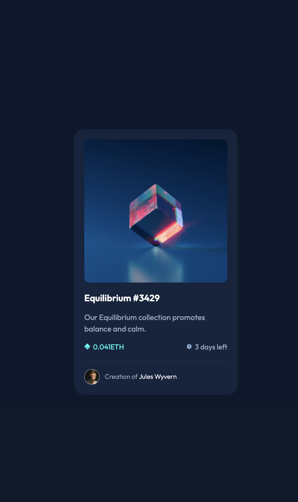
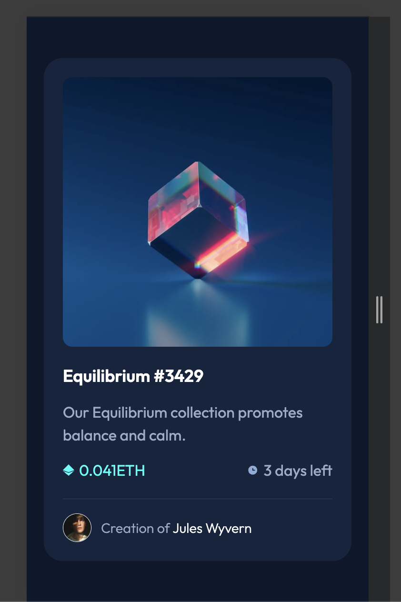

# NFT Preview Card Component Challenge - Frontend Mentor 🎨

## Overview 🌟

This is a solution to the [NFT Preview Card Component Challenge](https://www.frontendmentor.io/challenges/nft-preview-card-component-SdxFlVn4) from Frontend Mentor. The challenge involves building a responsive NFT preview card with interactive hover effects and a visually appealing design. The goal is to create a mobile-friendly design using HTML and CSS, focusing on Flexbox for layout and media queries for responsiveness.

## Table of Contents 📚

- [Overview](#overview)
- [Screenshot](#screenshot)
- [Links](#links)
- [Technologies Used](#technologies-used)
- [Features](#features)
- [How to Run](#how-to-run)

## Screenshots 📸

### Desktop View 💻


### Mobile View 📱


## Links 🔗

- Live Site: [View Live Site](https://tubular-fairy-563cf2.netlify.app/)
- Solution Repository: [GitHub Repository](https://github.com/KrishnaDhek/frontend-mentor-challenges/tree/main/NFT-preview-card-component)

## Technologies Used ⚙️

- HTML5
- CSS3 (Flexbox, Media Queries)

## Features ✨

- **Responsive Design**: The card adjusts its layout based on screen size, using media queries for small screens (up to 375px).
- **Image Overlay**: On hovering over the image, an overlay with a view icon appears, showcasing interactivity.
- **CSS Variables**: Used for easy theming and color changes.
- **Clean UI**: Simple and minimalistic design, focusing on the card details and the interaction.

## How to Run 🚀

1. Clone the repository:
   ```bash
   git clone https://github.com/KrishnaDhek/frontend-mentor-challenges
