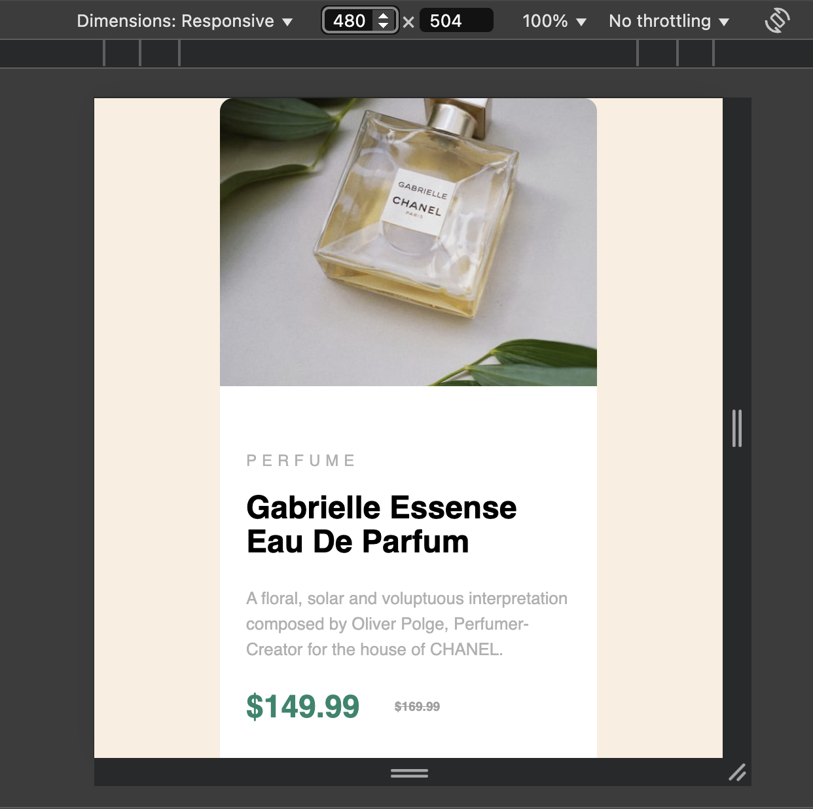

# Product Preview Card Component 🛒

This project is a **responsive product preview card** showcasing a product with an image, description, price, and an "Add to Cart" button. Built using **HTML** and **CSS** with Flexbox, the layout adapts to both desktop and mobile views.

---

## Table of Contents 📂
- [Overview](#overview)
- [Screenshot](#screenshot)
- [Links](#links)
- [Technologies Used](#technologies-used)
- [Features](#features)
- [Responsive Design](#responsive-design)
- [Desktop Design](#desktop-design)
- [How to Run](#how-to-run)

---

## Screenshot 📸

### Desktop Design:


### Mobile Design:


## Links 🔗

- Live Site: [View Live Demo](https://capable-meringue-dcc754.netlify.app/) 
- Solution Repository: [GitHub Repository](https://github.com/KrishnaDhek/frontend-mentor-challenges)

---

## Overview 𝌞

The **Product Preview Card** is a clean, modern component used to display a product with essential information like name, description, price, and a call-to-action button. This card uses a **flexible layout** for easy customization and ensures a smooth, responsive experience across different devices.

---

## Features✨

- **Responsive Design**: The card layout adapts to both **desktop** and **mobile** screens using media queries.
- **Image and Product Details**: Displays the product image on the left and product details on the right (for desktop), and stacks them vertically on mobile.
- **Price Display**: Original price is shown with a strikethrough to highlight discounts.
- **Interactive Button**: "Add to Cart" button changes color when hovered or clicked, enhancing the user experience.

---

## Responsive Design 📱

### Mobile View (Max Width: 580px):
- On mobile devices, the card layout changes to stack the image and product details vertically for better readability on smaller screens.
- The **product image** expands to full width but its height is restricted using `max-height` to maintain a balanced layout.
- **Product details** (including the name, description, and price) are adjusted to fill the available space, ensuring they remain clear and easy to read.
- The **"Add to Cart" button** spans the full width for easier interaction on touch devices.

---

## Desktop Design 💻

### Desktop View:
- On larger screens, the card layout displays **two columns**: the **image** on the left and the **product details** on the right.
- The **product image** retains a fixed width of 250px, ensuring a clean and balanced design without being too large or small.
- The **product details** (title, description, price, button) are neatly aligned to the right of the image, giving a professional look.
- The **"Add to Cart" button** sits at the bottom of the product details section, providing a clear and distinct call to action for the user.

---

## Technologies Used ⚙️

- **HTML**: Structure of the product card.
- **CSS**: Styling and layout using Flexbox for responsiveness.
- **SVG**: Shopping cart icon used in the "Add to Cart" button.

---

## How to Run 🚀

1. Clone the repository:
   ```bash
   git clone https://github.com/KrishnaDhek/frontend-mentor-challenges
